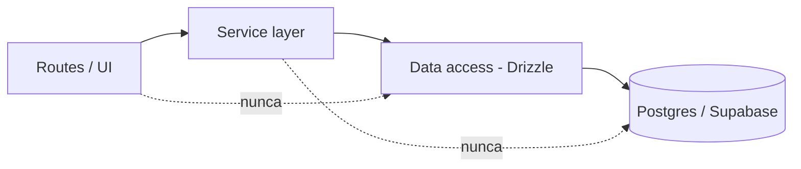
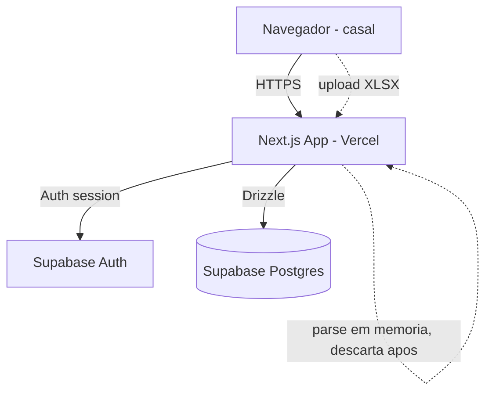
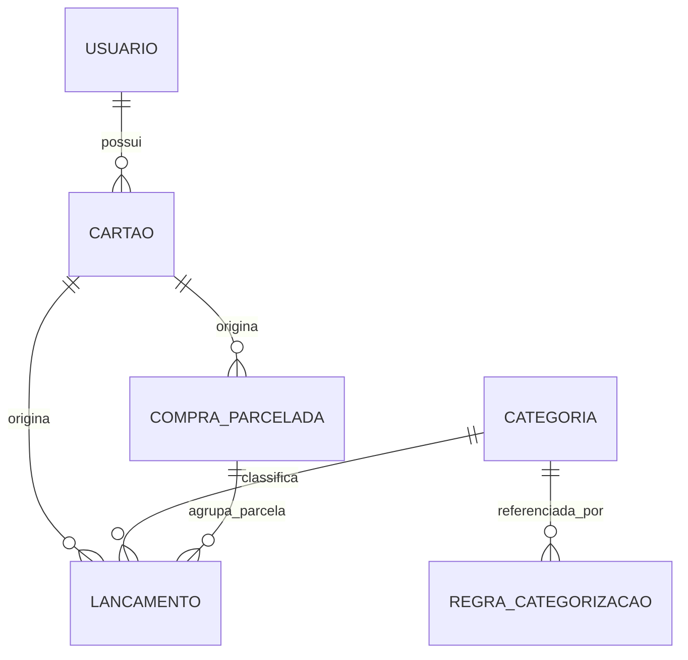

# Architecture Spine — Fatura a Dois

## Design Paradigm

Modular monolith em camadas por capacidade, servido por um único app Next.js (App Router). Cada capacidade da PRD (§4.1–4.5) vira um módulo vertical com a mesma forma interna:

`app/(routes)/<área>` (UI + route handlers) → `server/<módulo>` (regras de negócio) → `db/` (acesso a dados via Drizzle) → Postgres (Supabase).

Módulos: `auth`, `ingestao` (upload/parse, FR-2–FR-6), `categorizacao` (FR-7–FR-10), `parcelas` (FR-9, FR-12–FR-13), `visualizacao` (FR-11).



Regra de dependência: UI nunca chama `db/` diretamente; serviços nunca importam tipos de request/response do Next.js (mantém a camada de serviço testável e portátil).

## Invariants & Rules

### AD-1 — Atribuição de competência de lançamento real é sempre explícita, nunca derivada de data

- **Binds:** FR-4 (lançamentos reais extraídos de upload)
- **Prevents:** o parser inferir competência a partir de datas de lançamento em vez do valor selecionado no upload.
- **Rule:** o service de upload recebe `competencia_ano`/`competencia_mes` como parâmetro obrigatório explícito; nenhuma função de parsing lê ou infere limites de período a partir de datas para fins de atribuição de um lançamento real. Parcelas *projetadas* (FR-12) são a exceção documentada em AD-7 — esta regra não as contradiz, apenas não se aplica a elas.

### AD-2 — Chave de merge por delta vive num único módulo

- **Binds:** FR-5
- **Prevents:** um caminho de upload futuro (ex.: importação em lote) reimplementar o matching com uma chave diferente e duplicar ou descartar lançamentos silenciosamente.
- **Rule:** a chave (`data` + `estabelecimento` normalizado + `titular/cartão`; correspondência posicional dentro da mesma chave; `valor` fora da chave) vive em um único módulo compartilhado (`lancamento-matching`), nunca reimplementada.

### AD-3 — Uma função é a única autoridade de categorização

- **Binds:** FR-8, FR-10
- **Prevents:** UI, reprocessamento em lote ou uma API futura divergirem sobre qual regra vence.
- **Rule:** sugestão/resolução de categoria passa sempre pela mesma função/consulta, em duas etapas ordenadas: (1) filtrar `regra_categorizacao` cujo `padrao_estabelecimento` tem `similarity()` (`pg_trgm`) acima de um limiar configurável contra o estabelecimento normalizado (AD-9); (2) entre as regras que passam no limiar, a mais recentemente `atualizado_em` vence — o desempate é por recência, nunca pelo score de similaridade. `[ASSUMPTION: pg_trgm tem relatos de falha de habilitação em alguns projetos Supabase gerenciados — validar com uma spike antes de depender disso; se a extensão não funcionar de forma confiável, o fallback é fuzzy-match em nível de aplicação (biblioteca JS de similaridade de string), mantendo a mesma ordem de resolução acima.]`

### AD-4 — Identidade de compra original é uma chave única

- **Binds:** FR-9, FR-12
- **Prevents:** um módulo inventar sua própria heurística de matching de parcela, dessincronizando projeção e realização.
- **Rule:** `titular/cartão + estabelecimento normalizado + valor da parcela + total de parcelas` é a única chave usada para linkar uma parcela entre faturas e projeções futuras.

### AD-5 — Arquivo original nunca sobrevive além do parsing

- **Binds:** NFR Segurança/Durabilidade (PRD §7)
- **Prevents:** uma feature futura persistir os bytes crus da planilha além da transação de parsing.
- **Rule:** o XLSX original existe somente durante o passo de parsing da requisição de upload (memória/temp), nunca gravado em storage durável; só os lançamentos estruturados são persistidos.

### AD-6 — Toda rota de dado exige sessão válida `[ADOPTED]`

- **Binds:** FR-1
- **Prevents:** qualquer rota anônima/pública tocar lançamento, categoria ou parcela.
- **Rule:** middleware do Next.js valida sessão do Supabase Auth antes de qualquer route handler de dado. Já decidido na PRD (login obrigatório, sem auto-cadastro público) — a arquitetura só fixa o mecanismo. Recuperação de senha usa o fluxo nativo do Supabase Auth (magic link / reset por e-mail) — nunca um fluxo que dependa de recadastro, já que não há auto-cadastro público.

### AD-7 — Parcela projetada é sempre computada, nunca materializada; `compra_parcelada` tem um único dono

- **Binds:** FR-5, FR-9, FR-12
- **Prevents:** dois builders divergirem sobre quem escreve `compra_parcelada`, e parcelas futuras virarem linhas de `lancamento` (contagem dupla do mesmo gasto).
- **Rule:** parcelas futuras são **sempre** computadas em leitura (query/view a partir de `compra_parcelada`), nunca materializadas como linha de `lancamento`. `server/parcelas` é o único módulo que escreve em `compra_parcelada`. `server/ingestao` (merge por delta, AD-2) nunca escreve nessa tabela diretamente — ao remover um lançamento que é a primeira parcela conhecida de uma compra, `ingestao` chama uma função de serviço exposta por `server/parcelas` para retrair a projeção; nunca manipula a tabela por conta própria.

### AD-8 — `categoria` e `regra_categorizacao` são sempre compartilhadas, nunca por usuário

- **Binds:** FR-7, FR-8, FR-10
- **Prevents:** um builder adicionar uma coluna de escopo por usuário e `categorizacao`/`visualizacao` divergirem sobre quais categorias existem para quem.
- **Rule:** `categoria` e `regra_categorizacao` não têm (e nunca ganham) coluna `usuario_id` ou equivalente — são compartilhadas pelas duas contas do casal, sempre. Nenhum módulo particiona essas tabelas por usuário.

### AD-9 — Normalização de estabelecimento é uma função única e compartilhada

- **Binds:** FR-5 (via AD-2), FR-8/FR-10 (via AD-3), FR-9 (via AD-4)
- **Prevents:** cada módulo normalizar a mesma string de estabelecimento de um jeito diferente, quebrando o matching entre eles.
- **Rule:** uma única função compartilhada (`normalizar-estabelecimento`) é usada por `lancamento-matching`, `categorizacao` e `parcelas` — nenhum módulo reimplementa sua própria normalização.

## Consistency Conventions

| Concern | Convention |
| --- | --- |
| Naming (entidades, arquivos) | Entidades no banco em `snake_case` singular, português (`lancamento`, `categoria`, `regra_categorizacao`, `parcela`, `cartao`, `compra_parcelada`); `camelCase` em TypeScript. |
| Data & formats | Datas de lançamento em ISO 8601 sem hora. Valores monetários sempre em centavos (`integer`), nunca float. Competência como par explícito (`competencia_ano` int, `competencia_mes` int 1–12), nunca derivada de outra coluna. |
| State & cross-cutting | Mutação de dados sempre via camada de serviço (nunca query direta numa rota). Erros de domínio são exceções tipadas traduzidas para HTTP na borda da rota. Auth validada em middleware antes de qualquer route handler de dado (AD-6). |
| Segurança (PRD §7) | HTTPS obrigatório e criptografia em repouso são satisfeitas pela escolha de hospedagem gerenciada (Supabase + Vercel terminam TLS e cifram disco por padrão) — não exigem configuração própria do app. Senha nunca em texto plano: delegado ao Supabase Auth (hashing nativo), nunca reimplementado. |

## Stack

| Name | Version |
| --- | --- |
| TypeScript | 7.x (compilador nativo, GA jul/2026) `[DESVIO: rebaixado para 6.0.3 na Story 1.0 — typescript-eslint (via eslint-config-next) trava em runtime com TS 7.x, e a última versão publicada ainda declara peer typescript ">=4.8.4 <6.1.0". Revisitar e voltar para 7.x quando typescript-eslint suportar.]` |
| Next.js (App Router) | 16.2 |
| Node.js | 24 (LTS) |
| Supabase (Postgres + Auth + Storage) | hospedado, gerenciado |
| Drizzle ORM + Drizzle Kit | atual; usar `prepare: false` na conexão (pooling em modo transação do Supabase). `DIRECT_URL` do Drizzle Kit (migrations) usa o **session pooler** (porta 5432, mesmo host do pooler) em vez da conexão direta (`db.<ref>.supabase.co`) — essa é IPv6-only e não resolveu na rede de desenvolvimento (Story 1.0). |
| SheetJS (`xlsx`) | **instalar via `cdn.sheetjs.com`, não via npm** — a tag `xlsx` publicada no npm está travada em 0.18.5 (abandonada, com CVEs de prototype pollution/ReDoS não corrigidas); relevante aqui porque o app faz parsing de arquivo enviado por usuário |
| Extensão Postgres `pg_trgm` | built-in Postgres — ver ressalva de habilitação em AD-3 |
| Vercel | hospedagem/deploy |

## Structural Seed



**Deployment & ambientes:** um único ambiente de produção (Vercel + Supabase) — escala de 2 usuários não justifica staging formal ainda. Dev local via Supabase CLI (Postgres local em Docker) + `next dev`. Migrations via Drizzle Kit, aplicadas manualmente antes de cada deploy (sem pipeline de CI/CD formal nesta fase — ver Deferred). Point-in-Time Recovery do Supabase habilitado em produção — satisfaz o NFR de durabilidade da PRD (§7): como o arquivo XLSX original é descartado por design (AD-5), os lançamentos estruturados são a única cópia dos dados, e PITR é o mecanismo de recuperação caso sejam perdidos por bug ou falha.

**ERD (núcleo):**



- `usuario` — 2 linhas fixas (id, email, nome).
- `cartao` — id, identificador_banco, usuario_id (nullable até mapeamento, FR-6).
- `lancamento` — id, competencia_ano, competencia_mes, data, estabelecimento, valor_centavos, cartao_id, categoria_id (nullable), compra_parcelada_id (nullable), parcela_numero, parcela_total.
- `categoria` — id, nome (compartilhada entre as duas contas, não por usuário).
- `regra_categorizacao` — id, padrao_estabelecimento, categoria_id, atualizado_em.
- `compra_parcelada` — id, cartao_id, estabelecimento, valor_parcela_centavos, total_parcelas, competencia_inicial_ano, competencia_inicial_mes (âncora da identidade da AD-4).

```text
app/
  (auth)/                # login, recuperação de senha
  (app)/
    upload/               # UI de seleção de competência + upload (FR-2)
    lancamentos/          # visão por pessoa/categoria (FR-11)
    categorias/           # gestão de categorias (FR-7)
    parcelas/             # projeção e comprometimento (FR-12, FR-13)
server/
  ingestao/               # parsing, atribuição de competência, merge por delta (FR-2-FR-6)
  categorizacao/          # sugestão, regras, matching aproximado (FR-7-FR-10)
  parcelas/               # identificação e projeção (FR-9, FR-12, FR-13)
  visualizacao/           # agregações por competência/pessoa/categoria (FR-11)
  lancamento-matching/    # módulo único da chave de delta (AD-2)
  shared/normalizar-estabelecimento.ts  # função única de normalização (AD-9)
db/
  schema/                 # Drizzle schema (entidades do ERD acima)
  migrations/             # Drizzle Kit
```

## Capability → Architecture Map

| Capability / Area | Lives in | Governed by |
| --- | --- | --- |
| FR-1 Login obrigatório | `app/(auth)`, middleware | AD-6 |
| FR-2 Seleção de competência e upload | `app/(app)/upload`, `server/ingestao` | AD-1 |
| FR-3 Extração de lançamentos | `server/ingestao` | Stack (SheetJS) |
| FR-4 Atribuição de competência manual | `server/ingestao` | AD-1 |
| FR-5 Merge por delta | `server/lancamento-matching` | AD-2, AD-7, AD-9 |
| FR-6 Mapeamento cartão → conta | `server/ingestao` | — |
| FR-7 Gestão de categorias | `app/(app)/categorias`, `server/categorizacao` | AD-3, AD-8 |
| FR-8 Sugestão automática | `server/categorizacao` | AD-3, AD-9 |
| FR-9 Identificação de parcelas | `server/parcelas` | AD-4, AD-7, AD-9 |
| FR-10 Correção manual de categoria | `server/categorizacao` | AD-3, AD-8, AD-9 |
| FR-11 Visão por pessoa e categoria | `app/(app)/lancamentos`, `server/visualizacao` | AD-7 (parcelas computadas, não materializadas) |
| FR-12 Projeção de parcelas futuras | `server/parcelas` | AD-4, AD-7 |
| FR-13 Comprometimento do limite mensal | `server/parcelas` | AD-4, AD-7 |

## Deferred

- Parsers para outros bancos/formatos — não-objetivo explícito da PRD (§5).
- Orçamentos/alertas — passo natural de v2, não desta fase (PRD, Visão de crescimento).
- App nativo mobile — não-objetivo da PRD.
- Fila/job assíncrono para parsing — arquivo cabe em memória, processamento síncrono no próprio request é suficiente na escala atual; revisitar se faturas ficarem muito maiores.
- Staging/CI formal — 2 usuários não justificam ainda; revisitar se o parser quebrar com mudança de layout do Itaú (risco já registrado na PRD §7).
- Observabilidade/alerting dedicados — logs básicos do Vercel/Supabase bastam nesta escala; revisitar se o app crescer além do casal.
- Algoritmo exato / limiar de similaridade do `pg_trgm` (AD-3) — valor de threshold é uma decisão de tuning na implementação, não uma invariante.
